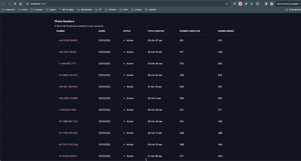

# Calls History

## Task

**Objective:**

- Part 1: Develop a RESTful API using Python (and preferably Django) that returns
dummy call history data for a given phone number.
- Part 2: Create a Next.js application that fetches call history data using the swr library
and displays it on a page.

**Part 1**
The API should expose the call history for a given phone number using dummy data.
Each record should include the time of the call, counterparty phone number, call status
('Completed Inbound', 'Missed Inbound', 'Completed Outbound', 'Missed Outbound'),
and duration in seconds (for completed calls).

You have the flexibility to design the API according to your preferences. Below is an
example to illustrate a possible approach for this endpoint:

GET `/calls/<phone_number>`

**Response:**

```json
[
{
"created_at": "2024-01-31T10:00:00Z",
"counterparty": "+13333333333",
"type": "Completed Inbound",
"duration": "37.4"
},
{
"created_at": "2024-01-31T11:00:00Z",

"counterparty": "+14444444444",
"type": "Missed Outbound"
}
]
```

**Part 2**
The Next.js application should display a page that displays the call history of a phone
number by going to /calls/<phone_number>

There’s no need for user authentication in this project.

## Implementation

As a side note, I am not familiar with the details of the Django ecosystem and haven't worked with Django professionally, so my library choices and implementation were the results of research. Similarly, I haven't worked with swr and Next.js professionally.

### API Server

1. Set up project structure and install Django and Django REST framework.

Django is a requirement for this project. I chose to integrate the Django REST framework due to its robustness and flexibility as a toolkit for building Web APIs. It enhances Django's capabilities, facilitating the creation of APIs that can interact with other services or serve as the backend for front-end applications, especially in Single Page Application (SPA) architectures that use frameworks like React or Angular.

2. Add Docker and PostgreSQL

**Prerequisites**: Docker must be installed.

Although Docker and PostgreSQL were not explicitly required, I opted to utilize Docker to ensure a consistent, isolated environment that simplifies setup and facilitates scaling, thereby guaranteeing that the application runs seamlessly on any system. Additionally, I chose PostgreSQL for the database to bring the solution closer to production readiness, demonstrating a commitment to robust and scalable architecture.

3. Models
 To effectively manage phone numbers within the system, I've integrated the [django-phonenumber-field](https://django-phonenumber-field.readthedocs.io/en/latest/#django-phonenumber-field). This choice was driven by the library's robust handling of international phone number formats and its seamless integration with Django, ensuring that our application adheres to global standards and improves data validity.

Architecture Decision
To ensure optimal database normalization and maintainability, I designed a dedicated PhoneNumber model separate from the CallHistory model. This architectural decision helps in segregating responsibilities within the system, leading to cleaner code and easier scalability. The PhoneNumber model exclusively manages phone number details, while the CallHistory model tracks the call-related data, thereby simplifying data management and enhancing the database's performance.

Data Population
The dummy data required for initial testing and simulation purposes is generated through a script located in the `api/` folder.

4. Views
  I decided to implement extra functionality because it made sense from a product perspective. First, the data can be massive, so we need to implement pagination to provide a better user experience. Second, an admin might want to examine the performance of a particular phone at a glance. So I used serializers to include extra data for the PhoneNumbers and implemented sorting and filtering using the library [django-filter](https://django-filter.readthedocs.io/en/stable/)


### Client

Per requirement, I am going to use Next.js and the swr library. For saving time in developing custom components, I chose to use TailwindCSS.
I decided to utilize infinite scrolling even though for a data-driven application it is not ideal (in oppose to table with pages)

### Running the application

1. clone the repo
2. make sure you have Docker installed
3. `cd server` folder and run
   ```
   docker-compose build
   docker-compose up
   ```

4. In a separate terminal, `cd client`
5. Run `npm install` and `npm run dev`
6. Open localhost:3000 to see the UI.


### Updating schema
   ```
   docker-compose build
   docker-compose up -d
   docker-compose run --rm web python manage.py makemigrations
   docker-compose run --rm web python manage.py migrate
   ```

### Running tests in python
   ```
   docker-compose build
   docker-compose up -d
   docker-compose run --rm web python manage.py test
   ```

### Demo


See screenshots in /assets folder

### Known Issues

- Filtering dates has some discrepancy - it includes previous date

### Next steps

1. Client tests
2. Sorting and filtering functionality on client
2. Implementing nice loading state
3. Breaking lists into smaller components
4. Utilizing env variables and production-ready libraries for deployment
5. Improvements


